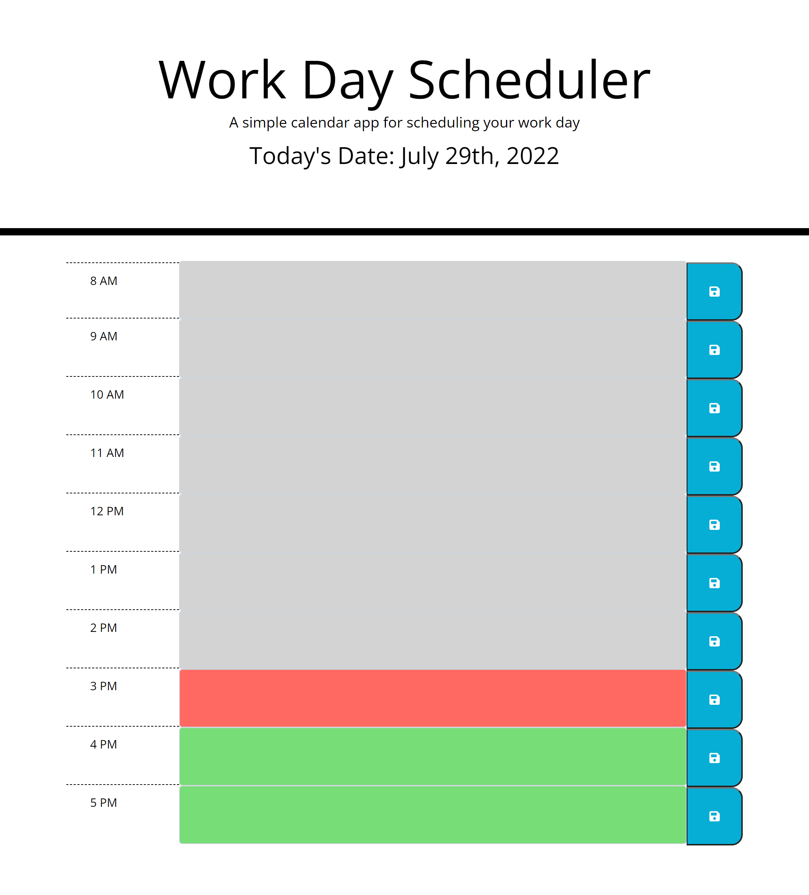

# Work Day Scheduler

## Purpose
To build a daily planner where I can add important events to manage my time effectively.

## Built With
* HTML - starter code provided
* CSS - starter code provided
* JavaScript

## Website
https://ezaiger.github.io/work-scheduler/

## Contribution
* Original code provided by courses.bootcampspot.com
* Revised code by EZaiger

